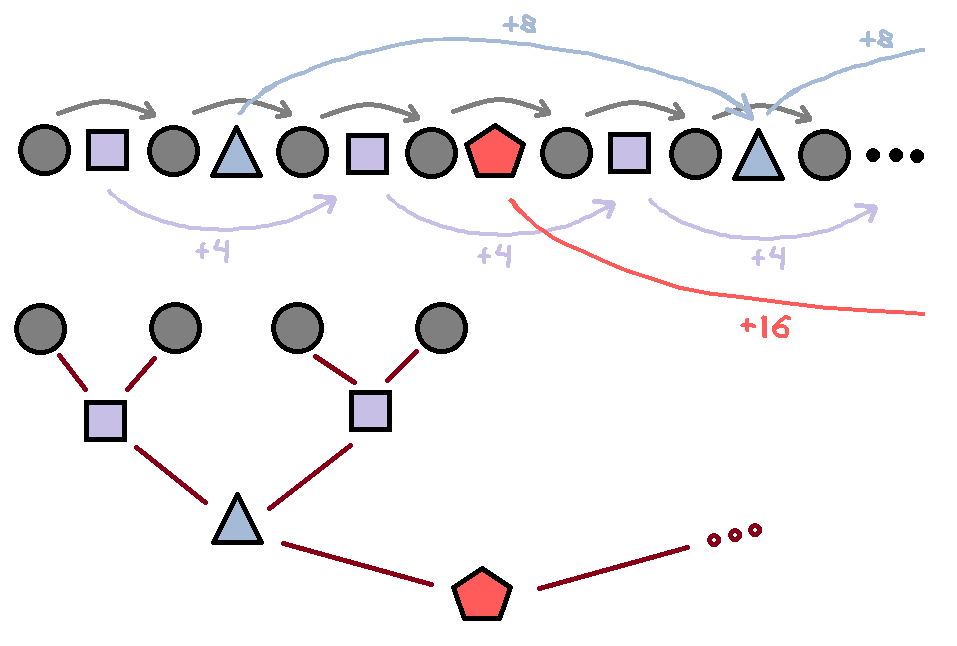

### AVL-дерево
Это двоичное дерево поиска, в котором поддерживается инвариант: для каждой его вершины высота её двух поддеревьев различается не более чем на 1.

АВЛ — аббревиатура, образованная первыми буквами создателей (советских учёных) Адельсон-Вельского Георгия Максимовича и Ландиса Евгения Михайловича.

---

---
### Обход дерева оператором ++
Следующий элемент - это либо min в правом поддереве, либо поднимаемся вверх до первого "подъема вправо".

Понятно что в худшем случае эта операция может занять $\ln n$.

Оценим сколько требуется, чтобы проитерироваться плюс-плюсом от $\text{b} \text{egin}()$ до $\text{e} \text{nd}()$. \
Рассмотрим идеальное дерево с $n = 2^h$ вершинами:

Отсюда получаем рекуретное соотношение: $a_{h+1} = a_h + h + h + a_h = 2 \cdot (a_h + h)$ \
Подставляя несколько раз, замечаем:

&nbsp; &nbsp; &nbsp; $a_h = 2 \cdot \Big{\(} a_{h-1} + (h-1) \Big{\)} = 2 \cdot \Big{\(} 2 \cdot \Big{\(} a_{h-2} + (h-2) \Big{\)} + (h-1) \Big{\)} $
 $=$ $\text{ . . . }$ $=$
 $2^1 \text{ } (h-1) + 2^2 \text{ } (h-2) + ... + 2^h \text{ } (h-h) + 2^h \cancelto{0}{a_0}$

&nbsp; &nbsp; &nbsp; $\Rightarrow \text{ }$ $\text{ }$
$a_h$ $\text{ } = \text{ }$ $\sum\limits_{k = 1}^{h-1} k \cdot 2^{h-k}$ 
$\text{ } = \text{ }$       $2^h \cdot \sum\limits_{k = 1}^{h-1} k \cdot \big{\(} \frac{1}{2} \big{\)}  ^k$
$\text{ } \stackrel{(*)}{=} \text{ }$   $\text{ . . . }$   $\text{ } = \text{ }$   $2 \cdot \big{\(} 2^h - h - 1 \big{\)}$

<table style="margin-left: auto; margin-right: auto;"> <tr>
    <td> $h$</td>
    <td>  1 </td>  <td> 2 </td>  <td> 3 </td>  <td> 4 </td>  <td> 5 </td>
</tr>  <tr>
    <td> $a_h$ </td>
    <td> 0  </td>  <td> 2 </td>  <td> 8 </td>  <td> 22</td>  <td> 56</td>
</tr> </table>

Оценивая сверху возьмем глубину $h \approx \ln_{\varphi} n$ $\text{ }$  $\Rightarrow$  $\text{ }$
$a_h \approx  2 ^ {\frac{ \ln 2 \varphi} {\ln \varphi} } \cdot n \approx 5.43 n$ \
Однако, численный расчет показал, что для рандомно заполненого дерева, кол-во операций удивительно близко к $2 n$ (выходит на плато c $n \sim 10^6$). Т.е. также как и для идеального дерева с тем же кол-вом вершин. \
P.s.: это было очевидно... По каждому ребру мы проходимся два раза, а ребер в дереве $(n-1)$.

$\text{ }$

$(*)$ Рассмотрим $\sum q ^ {\alpha \cdot k}$: 

&nbsp; &nbsp; &nbsp; &nbsp; &nbsp; ◦  &nbsp;  $\frac{\partial}{\partial \alpha} \sum q ^ {\alpha \cdot k}$   $\text{ } = \text{ }$
                        $\sum \frac{\partial}{\partial \alpha} e ^ {\alpha \cdot k \ln q}$   $\text{ } = \text{ }$
                        $\sum k \ln{q} \text{ } q ^ {\alpha \cdot k}$ 
                        
&nbsp; &nbsp; &nbsp; &nbsp; &nbsp; ◦  &nbsp;  $\frac{\partial}{\partial \alpha} \sum\limits_{k = 0}^{n-1} q^{\alpha k}$   $\text{ } = \text{ }$
                        $\frac{\partial}{\partial \alpha} \frac{1 - q^{\alpha n}}{1 - q^{\alpha \text{ }}}$ $\text{ } = \text{ }$   $...$
                       
&nbsp; $\Rightarrow$ $\text{ }$ $\sum\limits_{k=1}^{n-1} k \cdot q^k$  $\text{ } = \text{ }$   $\frac{(n-1) q^{n+1} - n q^n + q} {(1-q)^2}$

---

$\text{ }$

### Построение дерева из "массива"

Нас интересует как по номеру $i$ в массиве узнать на какой высоте $k$ будет расположенна вершина (будем нумеровать $i$ от $1$, а $k$ от $0$). \
Можно заметить, что высота определяется из условия:  $(i - 2^k) \text{ } \text{ } \vdots \text{ } \text{ } 2^{k+1}$ \
$\text{ } \text{ }$  $\Rightarrow \text{ } (i - 2^k) \text{ } = \text{ } 2^{k+1} \cdot t$   $\text{ } \text{ }$  $\Rightarrow \text{ } i = 2^k \cdot (2t - 1)$

Т.е. высота - это количество завершающих нулей в двоичной записи индекса $i$

---

$\text{ }$

### Реализация

Был предпринят отказат от ->right ->left, за место массива на 2 элемента: ->next[0] ->next[1] \
Это позволило избавиться от дублирования и немножко обобщить код

К реализации: [src/README.md](src/README.md)

---
### Source:
- Про наивное дерево поиска и AVL-дерево: https://www.youtube.com/watch?v=cuEwDXwh300

- Обходы дерева: https://www.youtube.com/watch?v=359wChqJJ4U

- Про merge: https://www.geeksforgeeks.org/merge-two-balanced-binary-search-trees/ \
  Вернее понятно что с массивом на $n_1 + n_2$ элементов можно легко сделать merge линейно, однако мне понравилась отсюда идея построения дерева из связного списка \
  Почему-то схожий вайб оставила [задача](https://www.codewars.com/kata/5e0607115654a900140b3ce3)

- Про Красно-чёрное дерево (для общего развития): https://www.youtube.com/watch?v=T70nn4EyTrs
